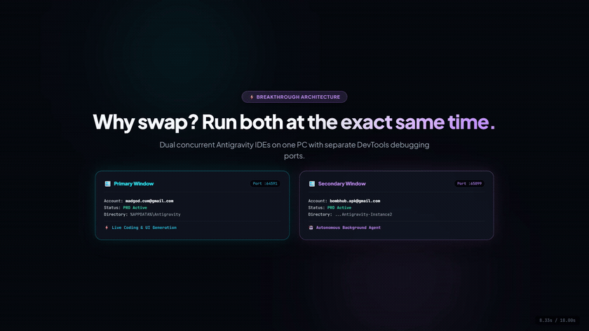
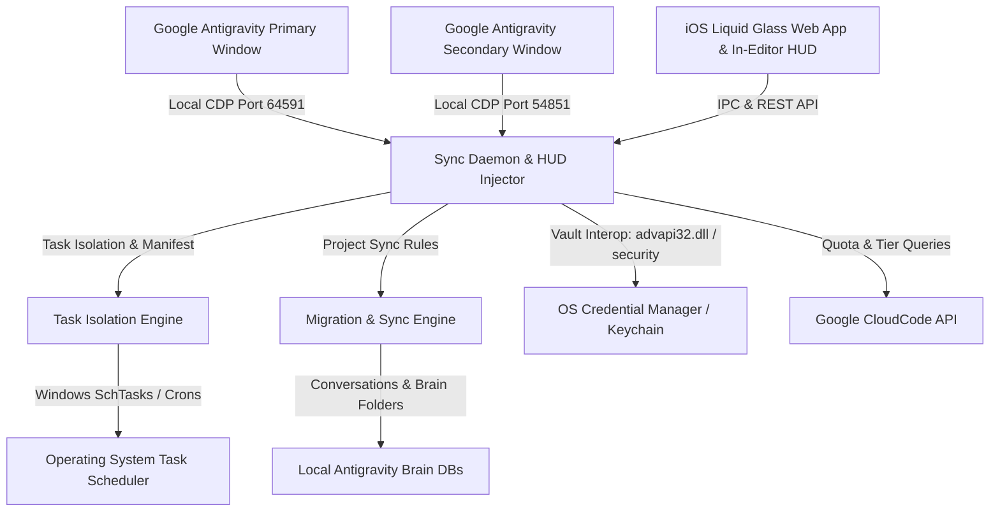

# Antigravity Account Switcher & Project Migration Suite ⚡️

[](LICENSE)
[]()
[]()
[]()
[]()
[](https://github.com/mad-helpers)

> **Super-fast 1-click Google Account Switcher, Concurrent Dual-Instance Runner, Real-Time Quota HUD, and AI Project & Chat Migration Suite for Google Antigravity.**  
> Crafted with Apple iOS Liquid Glass aesthetics, fluid 60fps spring physics, and multi-language support (English, Spanish, Persian, Chinese).

<p align="center">
  <a href="assets/teaser.mp4">
    
  </a>
</p>
<p align="center">
  <em>⚡️ <b>Watch the Official Launch Teaser</b>: 1-Click Identity Swap, Concurrent Dual IDE Instances & Scheduled Task Isolation. (<a href="assets/teaser.mp4">HD Video with Sound</a>)</em>
</p>


---

## 🌟 Quick Navigation / Navegación Rápida

- [English (🇬🇧 Overview & Features)](#-english)
- [Español (🇪🇸 Descripción y Características)](#-español)
- [فارسی (🇮🇷 راهنما و مستندات فارسی)](#-فارسی)
- [简体中文 (🇨🇳 概述与使用指南)](#-简体中文)
- [Installation & Quick Start](#-installation)
- [CLI Reference](#-cli-commands)
- [Architecture & Mechanics](#-architecture--how-it-works)

---

## 🚀 Installation

### 🪟 Windows 10 & 11 (PowerShell)
Open PowerShell as your standard user and run:
```powershell
irm https://raw.githubusercontent.com/mad-helpers/antigravity-account-switcher/master/install.ps1 | iex
```
*Creates `Antigravity Switcher` shortcuts on your Desktop & Start Menu, installs background sync daemons, and registers `agy-switch` in your PATH.*

### 🍏 macOS (Apple Silicon M1/M2/M3/M4 & Intel)
Open Terminal and run:
```bash
curl -fsSL https://raw.githubusercontent.com/mad-helpers/antigravity-account-switcher/master/install.sh | bash
```
*Builds and installs `AntigravitySwitcher.app` in `/Applications` and `~/Desktop`, and links `agy-switch` into your PATH.*

---

## 🇬🇧 English

### Overview
Switching between multiple Google accounts on **Google Antigravity** can be tedious and disruptive because session credentials are bound inside **Windows Credential Manager** (`service: "gemini"`, `account: "antigravity"`) or **macOS Keychain**.

**Antigravity Account Switcher & Migration Suite** by **[mad-helpers](https://github.com/mad-helpers)** (co-owned by **[Madgod-xyz](https://github.com/Madgod-xyz)** & **[Bombhub-apk](https://github.com/Bombhub-apk)**) is a high-performance native cross-platform solution (GUI, in-editor HUD pill, and CLI). It allows you to swap identities in under 3 seconds **or** run two completely isolated Antigravity instances side-by-side on the same machine with independent credentials, tasks, and project access.

### ✨ Key Features

1. ⚡️ **Dual-Instance Concurrent Multi-Window**:
   - Open a 2nd Antigravity window with a secondary Google account (`--user-data-dir="%APPDATA%\Antigravity-Instance2"`).
   - Work simultaneously on different projects or split workflows between personal and corporate accounts without logging out.
   - Separate DevTools debugging ports and state isolation.

2. 🔄 **Seamless In-Place Single-Window Switching**:
   - Swap identities in under 3 seconds directly within your active window.
   - Preserves active workspace paths and reloads credentials smoothly.

3. ⏱ **Scheduled Tasks & Cron Isolation**:
   - Tasks and scheduled automations created in Account 1 are isolated from Account 2.
   - Prevents accidental execution, modification, or deletion across accounts.
   - Clear permission enforcement with interactive visual status badges (`🔒 Locked`, `🛡️ Isolated`, `🌐 Shared`).

4. 📁 **Granular Project & Conversation Sync Hub**:
   - **Selective Workspace Sharing**: Choose exactly which projects and folders appear in Instance 2. Unselected projects will not bleed into the second instance.
   - **Safe Copy vs. Cut**: Clone projects to continue with fresh model quotas in the target account, or move and clean up the source.
   - **Transcript & Brain Migration**: Safely migrates local SQLite histories and agent brain artifacts without corrupting internal indices.

5. 📊 **In-Editor HUD Pill & Real-Time Quota Monitor**:
   - Injected live pill inside the Antigravity model bar displaying current account name and tier badge (`PRO`, `ULTRA`, `FREE`).
   - Live reset countdowns and percentage gauges for:
     - `Gemini 3.8 Flash High`
     - `Gemini 3.1 Pro`
     - `Claude Sonnet 4.6`
     - `GPT-OSS 120B`

6. 🍏 **iOS Liquid Glass Aesthetic**:
   - Frosted acrylic glass styling (`backdrop-filter: blur(40px)`), refined specular lighting, and fluid 60fps spring animations.

7. 🔒 **Privacy & Zero-Knowledge Credential Security**:
   - 100% local and offline. Never transmits tokens or credentials to external servers.
   - All OAuth tokens remain securely stored inside your operating system's native credential vault.

8. 💳 **Per-Project Quota Payer Allocation**:
   - Explicitly designate which account pays for prompts in each project.
   - Live credential switching immediately routes language server requests to the designated account.

---

### 💡 Quota Architecture: Single-Window vs. Concurrent Multi-Window Best Practices

#### 1. Single-Window Mode (100% Granular Freedom)
- In single-window mode, there are no competing processes for the OS credential store (`gemini:antigravity`).
- You can freely assign and switch the Quota Payer of any project with a single click in the in-editor switcher modal.
- The daemon instantly activates that account's token in Windows Credential Manager without restarting the editor, and the very next prompt is guaranteed to deduct from that account.

#### 2. Concurrent Multi-Window Mode (Clean Window-to-Project Binding)
- **OS Credential Architecture**: Windows maintains a single global credential target (`gemini:antigravity`) per OS user profile.
- **Cross-Wiring Race Condition Risk**: If Window 1 (Account A) is running a project configured to consume Account B, and Window 2 (Account B) is running a project configured to consume Account A, sending prompts concurrently at the exact same millisecond can trigger a race condition where one window temporarily overwrites the other's token.
- **Recommended Best Practice (Window Matching Rule)**:
  - Open projects intended to burn **Account A's quota** inside **Window 1 (Account A)**.
  - Open projects intended to burn **Account B's quota** inside **Window 2 (Account B)**.
  - Use the **Selective Project Sync** checklist to ensure projects only appear in their designated window. This enables you to run both windows side-by-side and prompt simultaneously with 0ms latency and zero cross-account conflicts.

#### 3. Scheduled Tasks & Background Scripts (100% Isolated)
- Background runners, cron jobs, and scheduled tasks are executed using `run_guarded_task`.
- The account token is injected directly into process environment variables (`process.env.GEMINI_CLI_OAUTH_TOKEN`) rather than modifying the OS credential vault.
- As a result, arbitrary background tasks across any number of accounts execute completely concurrently with zero risk of conflict.

---

## 🇪🇸 Español

### Descripción General
Cambiar entre múltiples cuentas de Google en **Google Antigravity** suele ser un proceso complejo debido a que las credenciales de sesión están almacenadas en el **Administrador de Credenciales de Windows** (`service: "gemini"`, `account: "antigravity"`) o en el **Llavero de macOS**.

La **Suite de Cambio de Cuenta y Migración para Antigravity** desarrollada por **[mad-helpers](https://github.com/mad-helpers)** (co-propiedad de **[Madgod-xyz](https://github.com/Madgod-xyz)** & **[Bombhub-apk](https://github.com/Bombhub-apk)**) es una solución nativa multiplataforma de alto rendimiento (GUI de escritorio, píldora HUD integrada en el editor y CLI). Permite alternar identidades en menos de 3 segundos **o** ejecutar dos ventanas de Antigravity simultáneamente de manera independiente con cuentas, tareas y proyectos completamente aislados.

### ✨ Características Principales

1. ⚡️ **Ejecución Concurrente de Dos Instancias (Doble Ventana)**:
   - Inicia una segunda ventana de Antigravity con tu cuenta secundaria (`--user-data-dir="%APPDATA%\Antigravity-Instance2"`).
   - Trabaja en paralelo en proyectos personales y profesionales sin necesidad de cerrar sesión ni interrumpir tu flujo de trabajo.
   - Puertos de depuración DevTools independientes y entornos de ejecución aislados.

2. 🔄 **Cambio Rápido en la Misma Ventana**:
   - Alterna entre cuentas en menos de 3 segundos dentro de la misma ventana activa.
   - Mantiene abiertos tus archivos y espacios de trabajo actuales.

3. ⏱ **Aislamiento de Tareas Programadas y Automatizaciones**:
   - Las tareas programadas y cron jobs creados en la Cuenta 1 no se ejecutarán ni interferirán con la Cuenta 2.
   - Evita la activación accidental de tareas entre perfiles con control de permisos y etiquetas visuales (`🔒 Bloqueada`, `🛡️ Aislada`, `🌐 Compartida`).

4. 📁 **Centro Granular de Sincronización y Migración**:
   - **Selección Selectiva de Proyectos**: Elige con precisión qué proyectos y carpetas están disponibles para la segunda cuenta. Los proyectos no seleccionados permanecen invisibles en la Instancia 2.
   - **Copia Segura o Traslado**: Clona conversaciones de IA para continuar programando con cuotas renovadas, o traslada todo el historial limpiando el origen.
   - **Migración de Transcripciones y Memoria Local**: Mueve el historial SQLite y los artefactos del agente sin dañar los datos.

5. 📊 **Píldora HUD Integrada y Monitor de Cuotas en Vivo**:
   - Píldora interactiva integrada en la barra de selección de modelos de Antigravity que muestra el nombre de la cuenta y la insignia del plan (`PRO`, `ULTRA`, `FREE`).
   - Medidores de cuota y temporizadores de reinicio en tiempo real para:
     - `Gemini 3.8 Flash High`
     - `Gemini 3.1 Pro`
     - `Claude Sonnet 4.6`
     - `GPT-OSS 120B`

6. 🍏 **Diseño Estilo iOS Liquid Glass**:
   - Interfaz con efecto de cristal esmerilado (`backdrop-filter: blur(40px)`), reflejos translúcidos y animaciones fluidas a 60 fps.

7. 🔒 **Privacidad Total y Cero Fuga de Credenciales**:
   - Ejecución 100% local y sin servidores externos.
   - Todas las credenciales se almacenan directamente en los módulos de seguridad protegidos de Windows y macOS.

---

## 🇮🇷 فارسی

### معرفی و قابلیت‌ها
این سوئیت جامع توسعه داده شده توسط سازمان **[mad-helpers](https://github.com/mad-helpers)** (مالکیت مشترک **[Madgod-xyz](https://github.com/Madgod-xyz)** و **[Bombhub-apk](https://github.com/Bombhub-apk)**)، راه‌حلی فوق‌العاده سریع و نیتیو برای سوئیچ هویت‌ها، اجرای همزمان دو پنجره مجزا و انتقال هوشمند پروژه‌ها و مکالمات ایجنت در **Google Antigravity** است.

### 🌟 قابلیت‌های کلیدی:
* ⚡️ **اجرای همزمان دو یا چند پنجره مجزا (Concurrent Multi-Window)** با جیمیل‌های کاملاً تفکیک‌شده و پوشه‌های مستقل داده (`Antigravity-Instance2`، `Antigravity-Instance3` و...).
* 🔄 **سوئیچ تک‌پنجره‌ای زیر ۳ ثانیه** بدون بستن یا از دست رفتن فایل‌های در حال ویرایش.
* 💳 **تعیین حساب کسر سهمیه به تفکیک پروژه (Per-Project Quota Payer)**: قابلیت انتخاب این که پرامپت‌های هر پروژه دقیقاً از سهمیه کدام اکانت کسر شوند.
* ⏱ **ایزوله‌سازی وظایف زمان‌بندی شده (Scheduled Tasks Isolation)**: اجرای مستقل تسک‌ها و کران‌جاب‌ها با متغیرهای محیطی ایزوله بدون کوچک‌ترین تداخل در مخزن کلید سیستم‌عامل.
* 📁 **مرکز گزینش و همگام‌سازی پروژه‌ها (Granular Project Sync Hub)**: انتخاب چک‌باکسی پروژه‌های مجاز برای اکانت دوم بدون قاطی شدن فایل‌های ناخواسته.
* 📊 **نشانگر شناور درون‌برنامه‌ای (In-Editor HUD Pill)** در نوار انتخاب مدل با نمایش رتبه (`PRO` / `ULTRA`) و مصرف لحظه‌ای سهمیه‌ها (تفکیک دقیق سهمیه ۵ ساعته و هفتگی).
* 🍏 **طراحی فوق‌العاده زیبای شیشه‌ای اپل (iOS Liquid Glass)** با انیمیشن‌های نرم ۶۰ فریم و پشتیبانی کامل راست‌چین (RTL).

---

### 💡 راهنمای معماری سهمیه‌ها: حالت تک‌پنجره در برابر چندپنجره‌ی همزمان

#### ۱. حالت تک‌پنجره (Single-Window - آزادی عمل ۱۰۰٪)
* در حالت تک‌پنجره، هیچ پروسه‌ی موازی دیگری برای مخزن توکن ویندوز (`gemini:antigravity`) رقابت نمی‌کند.
* **تغییر آنی کسر سهمیه**: در هر پروژه‌ای که باشید، کافی است در تب پروژه‌ها روی حساب مد نظرتان در بخش **«💳 کسر سهمیه از (Quota Payer)»** کلیک کنید. سیستم بلافاصله توکن همان حساب را در مخزن فعال می‌کند و از همان ثانیه، پرامپت بعدی ایجنت دقیقاً از سهمیه همان حساب کسر می‌شود.
* نشانگر وضعیت در پایین صفحه در لحظه نام اکانت و درصد باقیمانده سهمیه را بروزرسانی می‌کند.

#### ۲. حالت چندپنجره‌ی همزمان (Multi-Window Concurrency & Best Practice)
* **زیر کاپوت سیستم‌عامل**: ویندوز برای هر کاربر سیستم‌عامل یک مخزن واحد کلید دارد. هر پنجره ادیتور دارای پروسه مستقل زبانی است، اما مخزن کلید ویندوز بین پروسه‌ها مشترک است.
* **خطر تداخل ضربدری (Cross-Wiring Race Condition)**: اگر در پنجره ۱ (اکانت بمب‌هاب) پروژه‌ای باز کنید که روی سهمیه مدگاد تنظیم شده باشد، و همزمان در پنجره ۲ (اکانت مدگاد) پروژه‌ای باز کنید که روی سهمیه بمب‌هاب تنظیم شده باشد، در صورت **ارسال همزمان پرامپت در یک صدم ثانیه مشترک**، این دو پنجره برای تغییر توکن مخزن ویندوز با هم رقابت می‌کنند و ممکن است پرامپت از اکانت اشتباه کسر شود.
* **راهکار اصولی و پیشنهادی (قانون تطابق پروژه با پنجره)**:
  * پروژه‌های مربوط به سهمیه **اکانت ۱** را در **پنجره ۱** باز کنید.
  * پروژه‌های مربوط به سهمیه **اکانت ۲** را در **پنجره ۲** باز کنید.
  * با استفاده از قابلیت **«سینک انتخابی»** می‌توانید تعیین کنید هر پروژه فقط در پنجره اکانت خودش در دسترس باشد. در این حالت می‌توانید **هر دو پنجره را کنار هم بگذارید و به صورت کاملاً همزمان پرامپت بفرستید** بدون اینکه ۱ میلی‌ثانیه تداخل یا خطایی رخ دهد.

#### ۳. تسک‌های زمان‌بندی‌شده و اسکریپت‌های پس‌زمینه (۱۰۰٪ ایزوله)
* تسک‌های خودکار روزانه و اسکریپت‌های ایجنت با متد `run_guarded_task` اجرا می‌شوند.
* این متد توکن مخصوص اکانتِ تعیین‌شده برای آن تسک را مستقیماً داخل متغیرهای محیطی خود پروسه (`process.env.GEMINI_CLI_OAUTH_TOKEN`) تزریق می‌کند و کاری به مخزن ویندوز ندارد.
* بنابراین حتی اگر چندین تسک متعلق به چندین اکانت مختلف به طور همزمان اجرا شوند، کوچک‌ترین تداخلی ایجاد نخواهد شد.

---

## 🇨🇳 简体中文

### 概述与核心特性
由 **[mad-helpers](https://github.com/mad-helpers)**（联合所有者 **[Madgod-xyz](https://github.com/Madgod-xyz)** 与 **[Bombhub-apk](https://github.com/Bombhub-apk)**）精心打造的 Antigravity 账号管理与迁移套件，提供一键极速切号、多实例双开并发、任务隔离及项目资产跨账号同步功能。

* ⚡️ **多开并发实例**：同时运行两个独立的 Antigravity 窗口，各自绑定独立 Google 账号。
* 🔄 **秒级同窗口切换**：3 秒内平滑切换身份，保留当前项目。
* ⏱ **定时任务隔离**：主账号的自动化定时任务不会在第二账号触发，保证环境干净独立。
* 📁 **项目精细化勾选与同步**：按需分配对第二实例可见的项目和 Agent 对话。
* 📊 **编辑器内嵌配额 HUD**：实时显示剩余调用量及重置倒计时。

---

## ⌨️ CLI Commands

```bash
agy-switch                 # 🖥 Open the iOS Liquid Glass Desktop GUI
agy-switch --usage         # 📊 View live model quotas and countdowns in terminal
agy-switch --list          # 📋 List all saved accounts and active session
agy-switch --switch email  # ⚡️ Switch to a specific account immediately
agy-switch --save          # 💾 Save the current active account
agy-switch --logout        # ➕ Logout current account to sign into a new one
agy-switch --migrate       # 🔄 List local project conversations for migration
agy-switch --about         # ℹ️ Display author & version information
```

---

## 🛠 Architecture & How It Works



---

## 📄 License
Distributed under the **MIT License**. See `LICENSE` for details.

Developed with precision and care by **[mad-helpers](https://github.com/mad-helpers)** ([Madgod-xyz](https://github.com/Madgod-xyz) & [Bombhub-apk](https://github.com/Bombhub-apk)).
