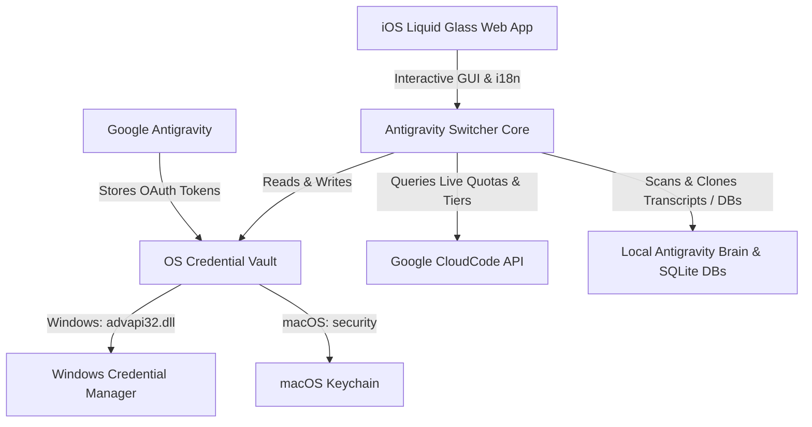

# Antigravity Account Switcher & Project Migration Suite ⚡️

[](LICENSE)
[]()
[]()
[]()
[]()
[](https://github.com/Madgod-xyz)

> **Super-fast 1-click Google Account Switcher, Real-Time Quota HUD, and AI Project & Chat Migration Suite for Google Antigravity.**  
> Crafted with Apple iOS Liquid Glass aesthetics, fluid 60fps spring physics, and 4 global languages (English, Persian, Chinese, Spanish).

<p align="center">
  
</p>

---

## 🌟 Quick Navigation / فهرست سریع

- [English (🇬🇧 Overview & Features)](#-english)
- [فارسی (🇮🇷 راهنما و مستندات فارسی)](#-فارسی)
- [简体中文 (🇨🇳 概述与使用指南)](#-简体中文)
- [Español (🇪🇸 Descripción y Uso)](#-español)
- [One-Line Installation](#-one-line-installation)
- [Architecture & Mechanics](#-architecture--how-it-works)

---

## 🚀 One-Line Installation

### 🪟 Windows 10 & 11 (PowerShell)
Open PowerShell and run:
```powershell
irm https://raw.githubusercontent.com/Madgod-xyz/antigravity-account-switcher/master/install.ps1 | iex
```
*Creates `Antigravity Switcher` shortcut on your Desktop & Start Menu, and registers `agy-switch` in your PATH.*

### 🍏 macOS (Apple Silicon M1/M2/M3/M4 & Intel)
Open Terminal and run:
```bash
curl -fsSL https://raw.githubusercontent.com/Madgod-xyz/antigravity-account-switcher/master/install.sh | bash
```
*Builds and installs `AntigravitySwitcher.app` in `/Applications` and `~/Desktop`, and links `agy-switch` in terminal PATH.*

---

## 🇬🇧 English

### Overview
Switching between multiple Google accounts on **Google Antigravity** can be frustrating because session credentials are securely locked inside **Windows Credential Manager** (`service: "gemini"`, `account: "antigravity"`) or **macOS Keychain**.

**Antigravity Account Switcher & Migration Suite** by **[Madgod-xyz](https://github.com/Madgod-xyz)** is an ultra-fast, native cross-platform solution (GUI & CLI) that allows swapping identities in under 3 seconds and seamlessly migrating projects and AI agent conversations between accounts.

### ✨ Key Features
1. 🍏 **iOS Liquid Glass Aesthetic**: Multi-layer frosted glass blur (`backdrop-filter: blur(40px)`), dynamic specular sheen, and smooth 60fps spring physics.
2. ⚡️ **Instant 1-Click Identity Swap**: Swap between personal, work, and client accounts without logging in each time.
3. 🔄 **Smart Project & Chat Migration Hub**:
   - **Selective Transfer**: Transfer all conversations, a specific project, or choose individual chat threads.
   - **Safe Copy vs. Cut**: Clone projects to continue with new quota in the target account without altering original data, or Move and clean up source.
   - **Flexible Layout**: Keep conversations as separate pages or merge into a unified chronological project timeline.
   - **Continuous Dual-Sync**: Option to keep future AI agent updates synchronized automatically across both accounts.
4. 📊 **Live Model Quota & Tier HUD**:
   - Live percentage meters and reset countdown timers for:
     - `Gemini 3.8 Flash High`
     - `Gemini 3.1 Pro`
     - `Claude Sonnet 4.6`
     - `GPT-OSS 120B`
   - Real-time detection of account tier: `Free`, `Pro`, `Ultra`, `Enterprise`.
5. 🌍 **Full 4-Language Localization**: English, Persian (full RTL with Vazirmatn font), Chinese Simplified, and Spanish.
6. 🔒 **100% Offline & Private**: Zero data transmission to third-party servers. All tokens remain stored in your system's native secure credential vault.

---

## 🇮🇷 فارسی

### معرفی و ویژگی‌ها
جابه‌جایی بین حساب‌های مختلف گوگل در محیط **Google Antigravity** به دلیل ذخیره‌سازی توکن‌ها در **Windows Credential Manager** یا **macOS Keychain** نیازمند خروج و ورود مکرر است.

این سوئیت جامع توسعه داده شده توسط **[Madgod-xyz](https://github.com/Madgod-xyz)**، راه‌حلی فوق‌العاده سریع و نیتیو برای سوئیچ آنی هویت‌ها و همچنین **انتقال و مهاجرت هوشمند پروژه‌ها و مکالمات ایجنت بین اکانت‌ها** فراهم می‌سازد.

### 🌟 قابلیت‌های برجسته:
* 🍏 **طراحی فوق‌لوکس شیشه‌ای مایع (iOS Liquid Glass)** با افکت‌های بلور عمیق، حاشیه‌های نوری کریستالی و فیزیک انیمیشن اسپرینگ مشابه کنترل‌سنتر آیفون.
* ⚡️ **سوئیچ زیر ۳ ثانیه** بین جیمیل‌ها به همراه بازنشانی خودکار و روان نرم‌افزار.
* 🔄 **مرکز هوشمند انتقال و مهاجرت پروژه‌ها و گفتگوهای ایجنت**:
  - امکان کپی ایمن (Safe Copy) برای حفظ داده در هر دو اکانت یا انتقال کامل (Cut).
  - انتخاب گزینشی مکالمات (یک چت، چند پروژه انتخابی یا همه).
  - چیدمان صفحات مجزا یا تجمیع در یک پروژه واحد.
  - همگام‌سازی دوطرفه خودکار (Continuous Dual-Sync).
* 📊 **نمایشگر سهمیه زنده و رتبه اشتراک اکانت**: تفکیک دقیق مدل‌های `Gemini 3.8 Flash High`، `Gemini 3.1 Pro`، `Claude Sonnet 4.6` و `GPT-OSS 120B` به همراه تایمر لحظه‌ای ریست و نمایش رتبه (`Pro`، `Ultra`، `Free`).
* 🌍 **پشتیبانی کامل ۴ زبانه** با راست‌چین هوشمند و فونت وزیرمتن برای زبان فارسی.

---

## 🇨🇳 简体中文

### 概述与核心特性
在 **Google Antigravity** 中切换多个 Google 账号通常十分繁琐。**Antigravity 账号切换器与项目迁移套件**（由 **[Madgod-xyz](https://github.com/Madgod-xyz)** 打造）提供了一键秒级切换、实时额度监测以及强大的 Agent 会话与项目资产跨账号智能迁移功能。

* 🍏 **iOS 晶莹磨砂设计**：高品质流体玻璃材质与原生 60 帧弹簧动画。
* ⚡️ **一键极速切换**：秒级切换工作、个人或测试账号，自动重启生效。
* 🔄 **会话与项目迁移中心**：
  - 支持安全克隆（两端保留）或完整剪切移动。
  - 支持独立会话项目排版或合并为主时间轴。
  - 可开启双向实时同步。
* 📊 **多模型额度实时追踪**：支持查看 Gemini 3.8 Flash、Gemini 3.1 Pro、Claude Sonnet 4.6 以及订阅版本（Free / Pro / Ultra）。

---

## 🇪🇸 Español

### Descripción y Características
Cambiar entre cuentas de Google en **Google Antigravity** ahora es instantáneo gracias a la suite desarrollada por **[Madgod-xyz](https://github.com/Madgod-xyz)**.

* 🍏 **Diseño Estilo iOS Liquid Glass**: Acabado de cristal esmerilado con física de resortes y aceleración por GPU.
* ⚡️ **Cambio en 1 Clic**: Alterna identidades en menos de 3 segundos.
* 🔄 **Centro Inteligente de Migración**: Clona o transfiere conversaciones y artefactos de tus proyectos entre cuentas sin perder tu progreso.
* 📊 **Monitor de Cuotas en Tiempo Real**: Seguimiento preciso de modelos de IA y estado de cuenta (Free, Pro, Ultra).

---

## ⌨️ CLI Commands

```bash
agy-switch                 # 🖥 Open the iOS Liquid Glass Desktop GUI
agy-switch --usage         # 📊 View live quotas and countdown in terminal
agy-switch --list          # 📋 List all saved accounts and active session
agy-switch --switch email  # ⚡️ Switch to a specific account immediately
agy-switch --save          # 💾 Save the current active account
agy-switch --logout        # ➕ Logout current account to sign into a new one
agy-switch --migrate       # 🔄 List local project conversations for migration
agy-switch --about         # ℹ️ Display author & version information
```

---

## 🛠 Architecture & How It Works



1. **Tokens Vault Interop**: Interacts directly with Windows Credential Manager (`gemini:antigravity`, `gemini`) via C# P/Invoke, and macOS Keychain via the `security` subsystem.
2. **Offline Local Agent Storage**: Inspects SQLite databases in `~/.gemini/antigravity/conversations/` and brain folders in `~/.gemini/antigravity/brain/` to safely clone and re-link project histories across accounts.
3. **No Interruption to In-IDE Tools**: Works seamlessly alongside the **Antigravity Quota Monitor & Smart RTL Suite**.

---

## 📄 License
Distributed under the **MIT License**. See `LICENSE` for details.

Developed with ❤️ by **[Madgod-xyz](https://github.com/Madgod-xyz)**.
